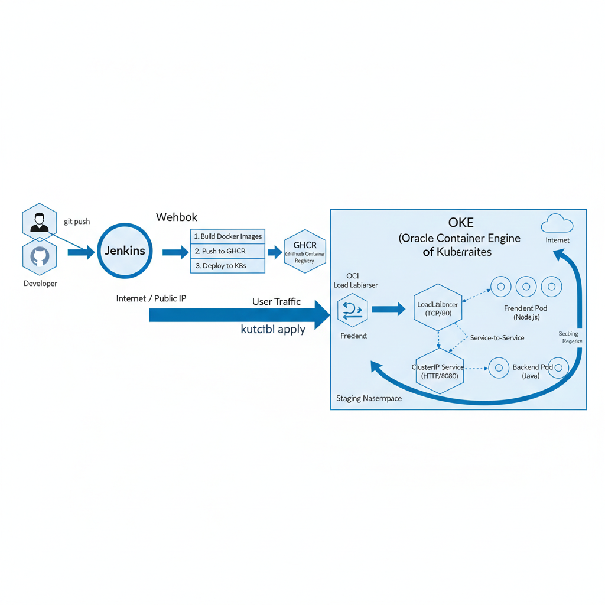
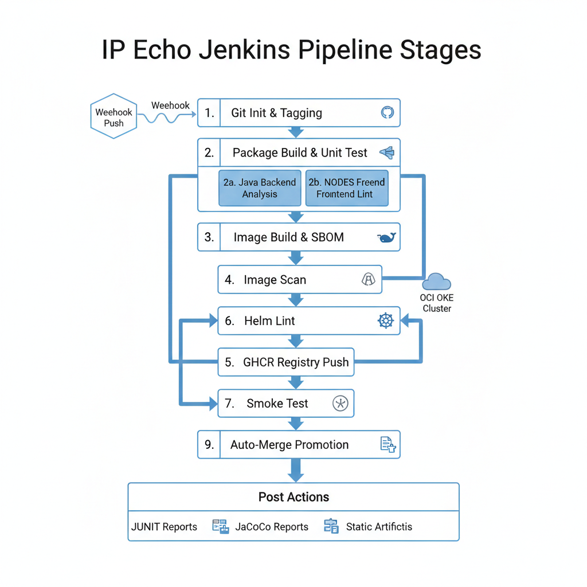

# BigID-DevOps-Assignment - IP Echo Project
This repository contains the files and explanation related to home assessment of DevOps Engineer position at BigID.

## 1. Project Overview | End-to-End DevOps Architecture
The IP Echo Project is a cloud-native application designed to demonstrate a robust CI/CD pipeline and microservices architecture. It echo's the client's IP address back to them, comprising a Node.js frontend and a Java backend, deployed on Kubernetes within Oracle Cloud Infrastructure (OCI).

## 2. Application Architecture

This application utilizes a **microservices architecture** deployed on Oracle Container Engine for Kubernetes (**OKE**).

### A. Networking Flow
1.  **Ingress:** Internet traffic hits an **OCI Load Balancer**, which routes requests to the `LoadBalancer` service in Kubernetes.
2.  **Frontend:** Traffic is distributed to 3 **Node.js Frontend Pods** by the Kubernetes service.
3.  **Service-to-Service:** The frontend communicates with the backend via internal DNS to a **ClusterIP** service.
4.  **Backend:** The ClusterIP service load balances requests across 2 **Java Backend Pods**.

### B. User Traffic Flow (External & Internal Networking)
1.  **User** sends a request via the internet to the **OCI Load Balancer IP**.
2.  Traffic hits the **Kubernetes LoadBalancer Service** (`TCP/80`).
3.  The Load Balancer distributes traffic to **Frontend Pods** (Node.js).
4.  Frontend Pods make an internal API call to the **Backend ClusterIP Service** (`HTTP/8088`).
5.  The ClusterIP Service load balances the request to **Backend Pods** (Java).
6.  Backend Pods process the request and return the IP data back through the same chain.

## 3. Architectural Diagram
The following diagram illustrates the flow from code commit to deployment, and the networking path of external traffic.



# IP Echo Project - CI/CD Pipeline Overview
This pipeline automates the entire lifecycle of the IP Echo application, from code commit to deployment in Oracle Container Engine for Kubernetes (OKE), utilizing **Jenkins**, **Docker**, **Helm**, and **GitHub Automation**.

## 1. Pipeline Stages

| Stage | Description | Key Actions |
| :--- | :--- | :--- |
| **Git Init & Tagging** | Prepares the workspace and versions the build. | Deletes old workspace, clones code, generates a unique `IMAGE_TAG` based on Git commit SHA and Jenkins Build ID. |
| **Package Build & Unit Test** | Parallelized building and testing of microservices. | **Backend:** Maven build (`mvn clean verify`) running JUnit tests, JaCoCo code coverage, Checkstyle, PMD, and SpotBugs.<br>**Frontend:** Dockerized npm linting and static analysis. |
| **Image Build & SBOM** | Creates container images and generates compliance data. | Builds backend and frontend Docker images. Uses **Syft** to generate a Software Bill of Materials (SBOM) in CycloneDX format. |
| **Image Scan** | Security scanning of the built images. | Uses **Trivy** to scan images for vulnerabilities, generating an HTML report and failing the build if HIGH/CRITICAL vulnerabilities are found. |
| **GHCR Registry Push** | Pushes images to the GitHub Container Registry. | Authenticates via GitHub Token and pushes images tagged with `IMAGE_TAG`. |
| **Helm Lint** | Validates Kubernetes manifests. | Validates Helm chart syntax against strict standards. |
| **Deploy to OKE** | Deploys application to OCI. | Configures `kubectl` and uses **Helm** to perform a rolling update on the OKE cluster in the `staging` namespace. |
| **Smoke Test** | Verifies deployment integrity. | Uses `curl` to check the `/health` endpoint of the deployed application. |
| **Auto-Merge Promotion** | Promotes successful builds to production branch. | Uses **GitHub CLI** to create a PR from the current branch to `main`, auto-merges, and deletes the branch. |

## 2. Post-Build Actions (Quality Gates)
Regardless of pipeline success or failure, the following actions are taken to ensure code quality and security:
* **JUnit & JaCoCo:** Publishes test results and code coverage metrics to Jenkins.
* **Artifact Archiving:** Saves SBOM and Trivy scan reports for audit purposes.
* **Static Analysis:** Records issues from Checkstyle, PMD, and SpotBugs for code quality tracking.

## 3. CI/CD Flow Diagram
The following diagram illustrates the flow between various stages of Jenkins pipeline.



## Deployment Commands

### Deploy to Staging Namespace
```bash
# Starting Minikube
minikube start

# To use locally built Docker image
eval $(minikube docker-env)

# Build Docker images - Frontend and Backend
docker build -t ip-echo-backend:local ./ip-echo-api-service
docker build -t ip-echo-frontend:local ./ip-displayer-frontend

# Create the staging namespace
kubectl create namespace staging

# Apply Frontend Deployments
kubectl apply -f frontend/deployment.yaml -n staging

# Apply Backend Deployments
kubectl apply -f backend/deployment.yaml -n staging

# Wait for pods to be ready
kubectl rollout status deployment/ip-echo-frontend -n staging
kubectl rollout status deployment/ip-echo-backend -n staging

# Apply Frontend Service
kubectl apply -f frontend/service.yaml -n staging

# Apply Backend Service
kubectl apply -f backend/service.yaml -n staging

# Tunneling Frontend
minikube service ip-echo-frontend -n staging
```


